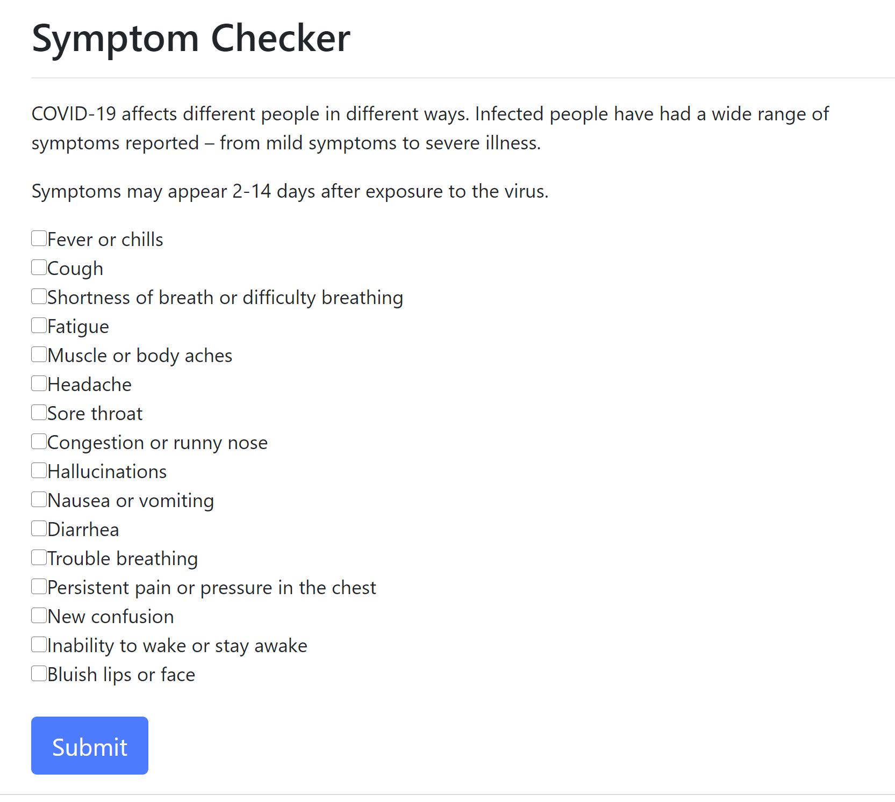
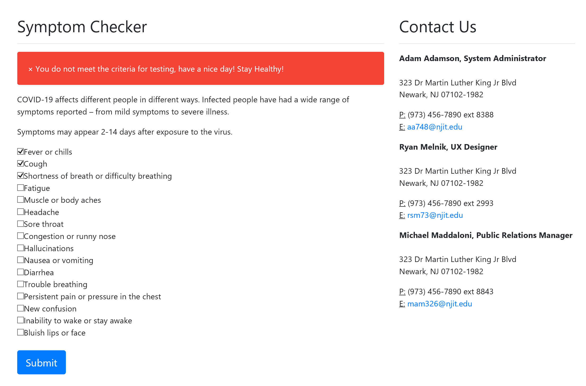
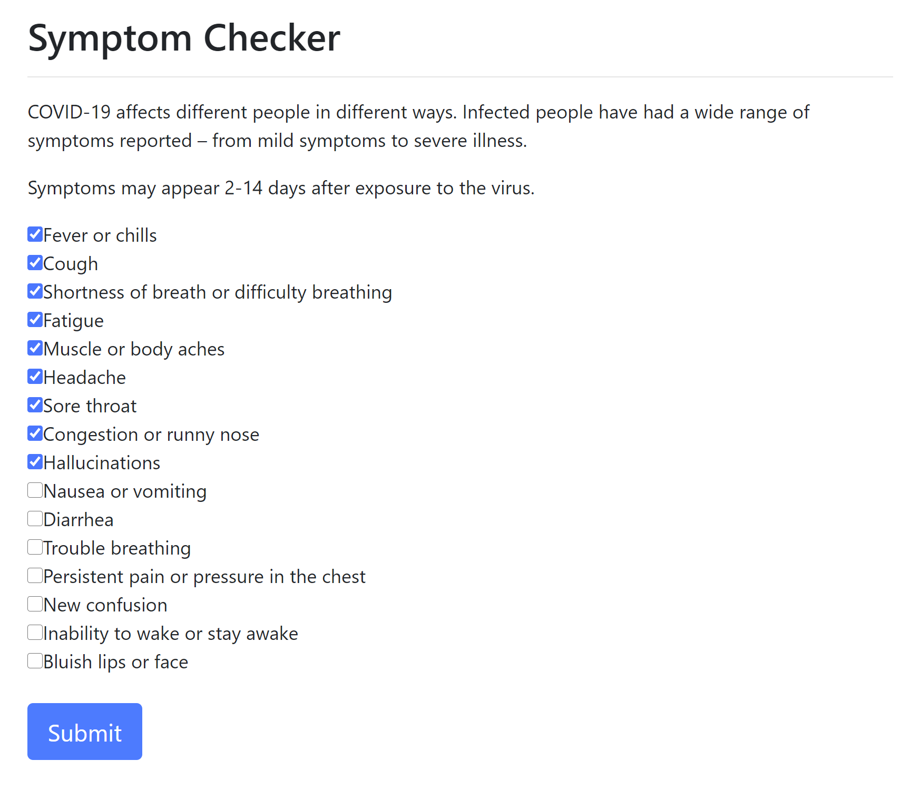
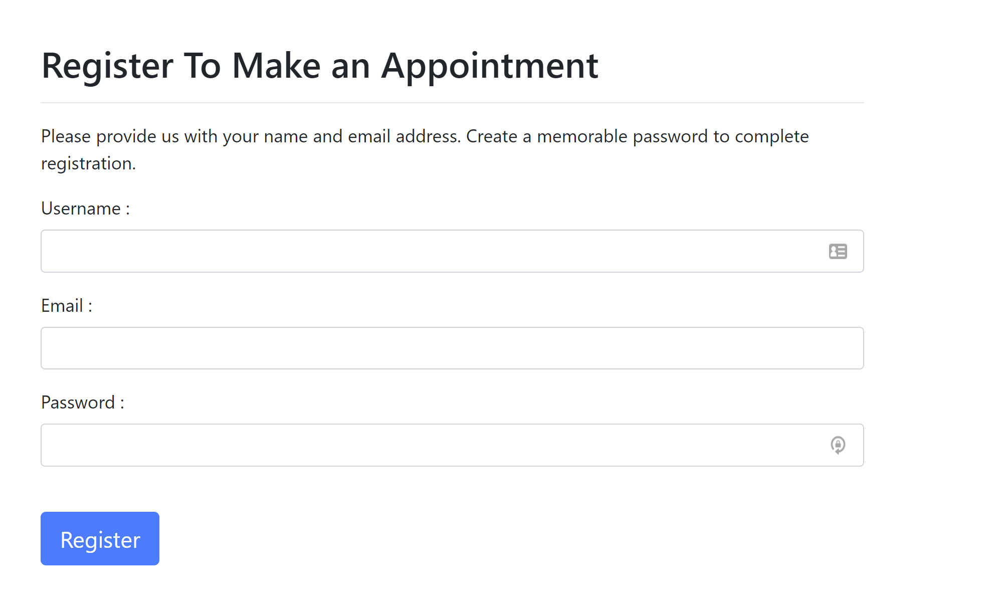
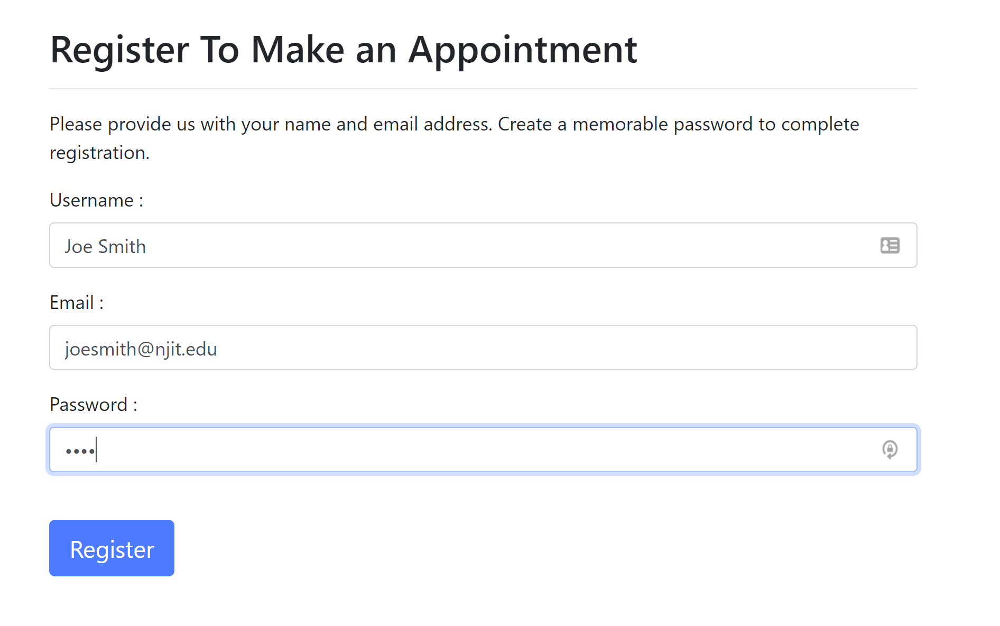
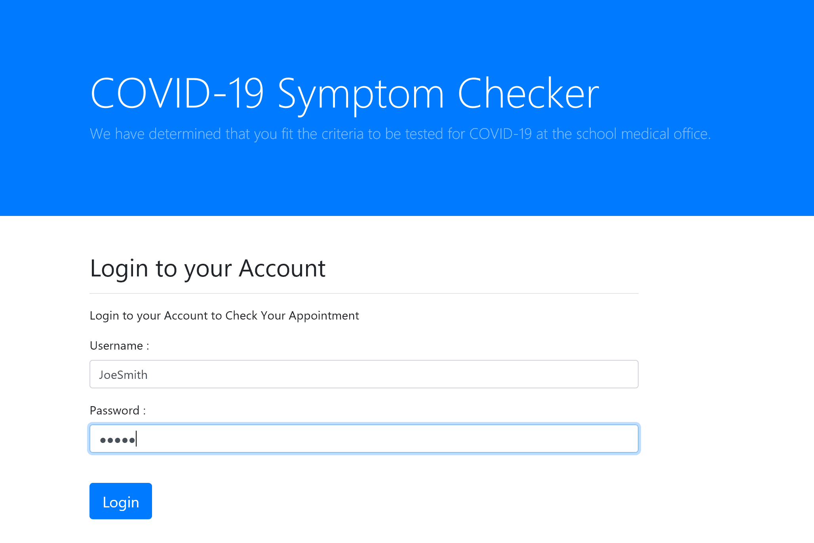

# covidtest

# COVID19 Student Self Check and Appointment Scheduler :syringe:
## By Adam Adamson, Michael Maddaloni, and Ryan Melink

# Purpose
This is an app which asks students to report any and all current symptoms they are experiencing.  If they are experiencing 8 or more symptoms they are directed to a registration form.  

# Program Guide
## Step 1
When a user loads the index file, they are presented with an array of checkboxes, 16 total.  

# Step 2
If a user selects fewer than 8 checkboxes, they are presented with a message stating they do not need to continue.

# Step 3
If a user selects 8 or more checkboxes they are automatically redirected to the registration page and are directed to submit their personal info.

# Step 4
The user will enter their information, and upon submit their information will be posted to the database.

# Step 5
If a user logs in successfully they will be taken to the calendar feature to find open times for appointment.

